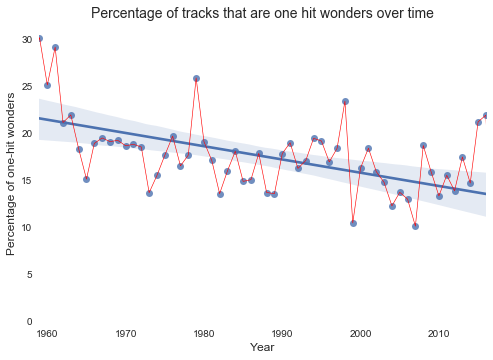
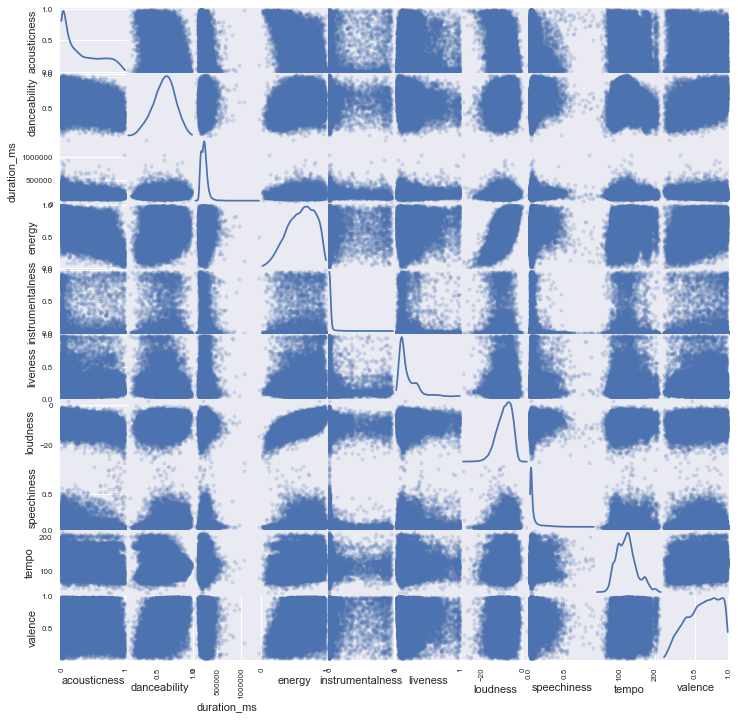

## Goal: 

The goal is to investigate the Billboard Top 100 dataset, which contains the Top 100 tracks ranked by popularity for every week between September 8, 1958 and January 8, 2017 to determine which features are driving song popularity.

## One-Hit Wonders
It makes sense that artist name would be a very big indicator of song popularity and if an artist is popular then many of their songs will reach the Top 100 regardless of song quality. The converse of this is the concept of a "one-hit wonder" where an artist releases one song that charts on the Top 100, but never has another one chart. 

We have the following graph of the percentage of tracks that reach the Top 100 each year that come from artists that have only ever had one song chart in the Top 100. 

**The percentage of one-hit wonders seems to have decreased over time, but is this really the case?**

On December 5, 1998, the Billboard Top 100 changed from being a "singles" chart to a "songs" chart, which allowed non-single tracks to be counted. We separate the data into two sets 1959-1998 and 1999-2016 and compare the average percentage of one-hit wonders each year. 

### Hypothesis Test: Percentage of one-hit wonders
$$H_0: \mu_\text{old} - \mu_\text{new} = 0$$
$$H_a: \mu_\text{old} - \mu_\text{new} \neq 0$$

We perform a ttest on the two datasets and obtain the following Z-statistic and p-value.

Z-Statistic:  3.33734125542  
95% Confidence Interval:  (0.012807220918658407, 0.052311307043165584)  
p-value:  0.00190495805707  

We obtain a p-value that is close to zero and with a statistical significance of alpha = 0.05 we obtain a 95% confidence interval that the true mean difference lies between 1.2% and 5.2%. 

**Thus we reject the null hypothesis.** 

We conclude that the percentage of tracks on the chart coming from artists that are one-hit wonders has decreased recently but the difference is not very significant.

## Spotify Audio Metadata Features
For the Billboard Top 100 we also have the following audio metadata features
"acousticness", "danceability", "duration_ms", "energy" ,"instrumentalness", "liveness", "loudness", "speechiness", "tempo" and "valence" for 78.33% of the tracks in the Billboard Top 100. We wish to investigate if there is any correlation between these audio features. We perform a scatterplot matrix to check for correlation.

We see that instrumentalness and speechiness appears to be more of a binary relationship and there exists a clear positive relationship between loudness and energy. On the other hand, the relationship between danceability and energy does not appear to be as strong one might expect.

We then use the stats linear regression package to find the r^2 coefficient of determination.

For loudness and energy we get an r^2 value of 0.7055 which indicates that there is indeed a strong positive relationship between the two variables.

We also investigate the relationship between tempo, energy and danceability. Tempo and energy has an r^2-value of 0.1649, danceability and energy has an r^2-value of 0.2205 and tempo and danceability has an r^2-value of -0.1613 all of which imply that there is not a strong correlation between them.

## Future Investigations
We also investigate key popularity and plan to use sentiment analysis on the song lyrics. We will then investigate if there is any relationship between whether the song is in a major or minor key and whether the lyrical sentiment is positive or negative. 
